# OpenTikZ

> A TikZ resource library for academic conceptual diagrams — copyable icons,
> editable architecture templates, and one AI-consumable skill that lets Claude
> Code modify those templates, so researchers produce paper figures fast without
> writing TikZ from scratch.

OpenTikZ is the "Flaticon for academic TikZ", focused on conceptual/overview
figures — system block diagrams, neural-network architectures, pipelines, and
flowcharts. **Data plots are out of scope** (use pgfplots/matplotlib).

## Quick start

1. Browse the **[gallery](#gallery)** below and pick an icon, template, or example.
2. Copy its `.tex` into your project — every file compiles standalone with
   `pdflatex`, `lualatex`, or `xelatex`, no extra setup.
3. Want changes? Tell Claude Code *"add a hidden layer / recolor this blue / fit
   it to a CVPR column"* — the `using-opentikz` skill plus each template's
   `edit_contract` guide the AI to edit it correctly.

## Gallery

Every preview is rendered from the committed `.tex` source (no mockups). Click a
figure to open its source folder. A searchable web gallery with copy-to-clipboard
is generated from this repo — see [Website](#website).

### Examples — paper-grade figures combining icons + templates

<table>
<tr>
<td align="center" width="33%"><a href="examples/lora/"></a><br><sub><b>LoRA</b> · low-rank adaptation</sub></td>
<td align="center" width="33%"><a href="examples/distributed-training/">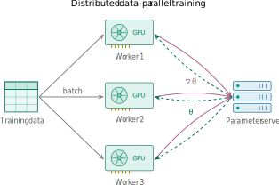</a><br><sub><b>Distributed</b> data-parallel training</sub></td>
<td align="center" width="33%"><a href="examples/inference-serving/">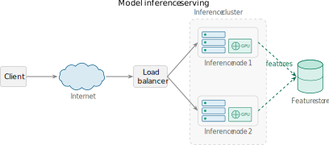</a><br><sub><b>Inference</b> serving</sub></td>
</tr>
</table>

### Templates — editable, AI-modifiable (each ships an `edit_contract`)

<table>
<tr>
<td align="center" width="33%"><a href="templates/neural-net/"></a><br><sub><b>Feed-forward</b> neural network</sub></td>
<td align="center" width="33%"><a href="templates/encoder-decoder/"></a><br><sub><b>Encoder-decoder</b> · bottleneck</sub></td>
<td align="center" width="33%"><a href="templates/training-pipeline/">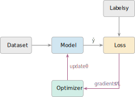</a><br><sub><b>Training pipeline</b> · loss/optimizer loop</sub></td>
</tr>
<tr>
<td align="center" width="33%"><a href="templates/system-block-diagram/">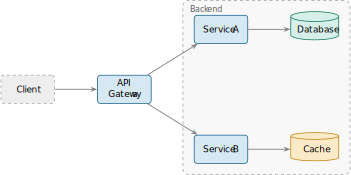</a><br><sub><b>System</b> block diagram</sub></td>
<td align="center" width="33%"><a href="templates/flowchart/">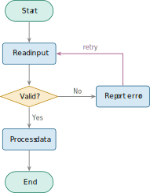</a><br><sub><b>Flowchart</b> · decision + loop</sub></td>
<td width="33%"></td>
</tr>
</table>

### Icons — atomic, single-concept, independently copyable

<table>
<tr>
<td align="center" width="20%"><a href="icons/systems/server/"></a><br><sub>Server</sub></td>
<td align="center" width="20%"><a href="icons/systems/cpu/">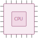</a><br><sub>CPU</sub></td>
<td align="center" width="20%"><a href="icons/systems/gpu/"></a><br><sub>GPU</sub></td>
<td align="center" width="20%"><a href="icons/systems/cloud/"></a><br><sub>Cloud</sub></td>
<td align="center" width="20%"><a href="icons/systems/database/"></a><br><sub>Database</sub></td>
</tr>
<tr>
<td align="center" width="20%"><a href="icons/systems/user/"></a><br><sub>User</sub></td>
<td align="center" width="20%"><a href="icons/systems/container/"></a><br><sub>Container</sub></td>
<td align="center" width="20%"><a href="icons/systems/network/">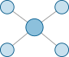</a><br><sub>Network</sub></td>
<td align="center" width="20%"><a href="icons/systems/queue/"></a><br><sub>Queue</sub></td>
<td align="center" width="20%"><a href="icons/systems/disk/">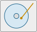</a><br><sub>Disk</sub></td>
</tr>
<tr>
<td align="center" width="20%"><a href="icons/systems/mobile/"></a><br><sub>Mobile</sub></td>
<td align="center" width="20%"><a href="icons/ml/neuron/"></a><br><sub>Neuron</sub></td>
<td align="center" width="20%"><a href="icons/ml/layer/"></a><br><sub>Layer</sub></td>
<td align="center" width="20%"><a href="icons/ml/attention/"></a><br><sub>Attention</sub></td>
<td align="center" width="20%"><a href="icons/ml/dataset/"></a><br><sub>Dataset</sub></td>
</tr>
<tr>
<td align="center" width="20%"><a href="icons/ml/transformer/">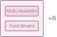</a><br><sub>Transformer</sub></td>
<td align="center" width="20%"><a href="icons/ml/embedding/"></a><br><sub>Embedding</sub></td>
<td align="center" width="20%"><a href="icons/ml/convolution/">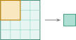</a><br><sub>Convolution</sub></td>
<td align="center" width="20%"><a href="icons/ml/model/"></a><br><sub>Model</sub></td>
<td align="center" width="20%"><a href="icons/ml/loss/">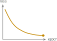</a><br><sub>Loss</sub></td>
</tr>
</table>

> Previews are transparent SVGs; labels read best on a light background. The live
> [website](#website) renders them on paper-white tiles.

## Three-layer content model

- **`icons/`** — atomic, single-concept TikZ elements, each compiles standalone
  and is independently copyable.
- **`templates/`** — complete, editable conceptual figures (the core value); each
  carries an `edit_contract` in its `meta.json` describing how to edit it safely.
- **`skills/using-opentikz/`** — the one repo-wide skill that lets an AI agent go
  from a request to a finished figure (discover, edit, verify), backed by the
  per-template `edit_contract`s and the `reference/` material below.

## Repository layout

```
icons/<domain>/<name>/      <name>.tex + <name>.meta.json + <name>.svg
templates/<name>/           template.tex + template.meta.json (+ edit_contract) + preview.svg
skills/using-opentikz/      the one repo-wide skill (SKILL.md)
reference/                  color-palettes/, annotations/, layout/
examples/<name>/            paper-grade figures combining icons + templates
skills-demos/               before/after SVGs for the website's "skills in action"
tools/                      build_catalog.py, render_preview.py, build_site.py, validate.py
meta.schema.json            JSON Schema for every .meta.json
catalog.json                AUTO-GENERATED — do not hand-edit
```

See [`CLAUDE.md`](CLAUDE.md) and [`docs/`](docs/) for the full product spec,
design guide, and roadmap. Want to add a figure? See [`CONTRIBUTING.md`](CONTRIBUTING.md).

## Tooling

```bash
python3 -m pip install -r requirements.txt   # installs jsonschema
python3 tools/validate.py                     # validate metadata + compile .tex
python3 tools/build_catalog.py                # regenerate catalog.json
python3 tools/render_preview.py <item>        # render a trimmed .svg preview
```

`validate.py` and `render_preview.py` need a LaTeX toolchain (`latexmk`) plus an
SVG backend (`dvisvgm`, or `pdf2svg` + `pdfcrop`). Without LaTeX installed,
`validate.py` still checks metadata and skips the compile step.

## Website

A static gallery (search + per-item pages with copyable `.tex`) is generated from
`catalog.json` and the committed `.svg` previews — no LaTeX needed:

```bash
python3 tools/build_catalog.py     # ensure catalog.json is current
python3 tools/build_site.py        # generates site/ (gitignored)
python3 -m http.server -d site     # preview at http://localhost:8000
```

It deploys to GitHub Pages automatically via `.github/workflows/pages.yml` on
push to `main`. Client-side search uses Fuse.js (CDN, pinned + SRI).

## Citing OpenTikZ

Content is CC0, so a citation is never required — but if OpenTikZ saved you time,
it is appreciated:

```bibtex
@misc{opentikz,
  title        = {{OpenTikZ}: a TikZ resource library for academic conceptual diagrams},
  author       = {{OpenTikZ contributors}},
  year         = {2026},
  howpublished = {\url{https://github.com/opentikz/opentikz}},
  note         = {Content licensed CC0 1.0}
}
```

## Licensing

- **Code** (scripts, build tooling): MIT — see [`LICENSE-CODE`](LICENSE-CODE).
- **Graphic content** (`.tex` figures and previews): CC0 1.0 — see
  [`LICENSE-CONTENT`](LICENSE-CONTENT).

By contributing graphic content you agree to release it under CC0 1.0. See
[`CONTRIBUTING.md`](CONTRIBUTING.md).
