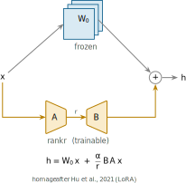
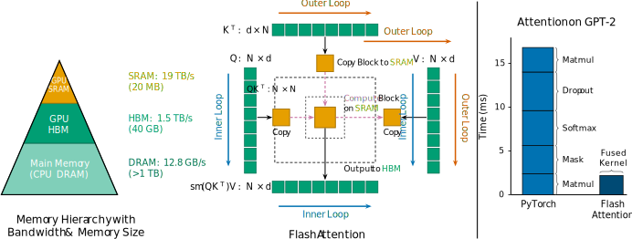
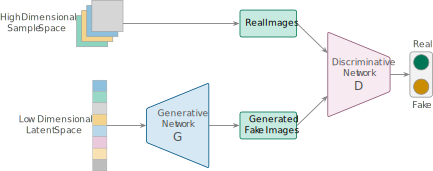
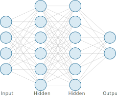
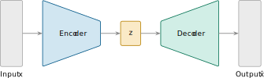
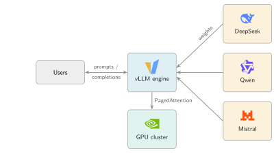
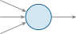
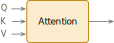

<div align="center">

<a href="https://opentikz.org"></a>

### Describe your figure. Get it, paper-ready.

More than an AI-agent skill for LaTeX TikZ figures.

[](https://github.com/opentikz/opentikz)
[](https://github.com/opentikz/opentikz/actions/workflows/ci.yml)
[](https://github.com/opentikz/opentikz/actions/workflows/pages.yml)
[](https://opentikz.org)
[](LICENSE-CODE)
[](LICENSE-CONTENT)

**[Website](https://opentikz.org)** · [Browse](https://opentikz.org/browse/) · [Templates](templates/) · [Icons](icons/) · [Examples](examples/) · [Quick start](#quick-start) · [Contributing](CONTRIBUTING.md)

</div>

---

OpenTikZ is the "Flaticon for academic TikZ" — conceptual/overview figures
(system block diagrams, neural-network architectures, pipelines, flowcharts) for
your papers, made fast. Four ways to use it:

- **Use icons** — grab a single icon, no AI needed: copy its `.tex` (or download SVG/PNG) and `\input` it.
- **Edit a template** — tell the agent the change; it edits the template and verifies it compiles.
- **PNG → TikZ** — hand the agent a figure image; get editable TikZ back.
- **Describe → TikZ** — describe a figure in words; the agent drafts it from the library.

## Quick start

**Use it with your AI agent (recommended).** Install the Claude Code plugin —
run these as two separate Claude Code messages:

```text
/plugin marketplace add https://github.com/opentikz/opentikz
/plugin install opentikz@opentikz
```

Then describe the figure or edit you want
-  *"draw an encoder–decoder with a cross-attention block,"* or, 
- pointing at a template, *"add a hidden layer / recolor this blue / fit it to a CVPR column."*   
The skill finds the figure, copies it into your project, edits it via each template's `edit_contract`, and compiles it before
handing it back. Invoke it as `/opentikz:using-opentikz`.

**Other agents (Codex, Cursor, Gemini CLI…).** `git clone` this repo and tell the
agent to use `skills/using-opentikz/SKILL.md`, or just point a GitHub-reading agent
at the repo URL.

**Prefer no AI?** [Browse the gallery](#gallery), copy a figure's `.tex`, and paste
it in — every file is `\documentclass{standalone}` and compiles as-is.

## Why TikZ, and why OpenTikZ

**Why TikZ at all?** A TikZ figure is *source code*, not an image:

- **Vector quality** — crisp at any zoom, sharp in print; no pixelated screenshots.
- **Native to your paper** — same fonts, math (`$\mathbf{W}x$`), and
  `\ref`/`\cite` as the document, so the figure looks part of the paper.
- **Diffable** — version it in git, tweak one number, recompile.

**Why not just ask ChatGPT for TikZ directly?** You can — but raw LLM TikZ tends
to fight you. OpenTikZ anchors the edit to a real, parametric template:

| What you care about | Raw LLM TikZ | OpenTikZ + skill |
| --- | --- | --- |
| Compiles first try | Often not | Yes, standalone |
| Packages / macros | Sometimes invented | Real, declared in `requires` |
| Colors | Random hex | Shared palette |
| Re-editing later | Re-describe everything | Stable node names |
| AI guidance | None | Each template ships an `edit_contract` |

Because every template is parametric, palette-correct, and carries an
`edit_contract`, an agent edits it **accurately** and **fast** instead of
hand-writing TikZ that may not compile.

### A concrete edit

Starting from [`templates/encoder-decoder/`](templates/encoder-decoder/), tell
Claude Code:

> *"add a cross-attention block and make it blue"*

Guided by the template's `edit_contract` — using the shared palette and the
template's stable node names — it adds:

```tex
% cross-attention block (decoder attends to encoder)
\node[draw=otblue!80!black, fill=otblue!18, rounded corners=2pt,
  minimum width=\trapW cm, minimum height=0.7cm]
  (xattn) at (\xdC,\bh+0.9) {\sffamily\small Cross-Attn};
\draw[flow, draw=otblue] (enc) to[bend left=20] (xattn);
\draw[flow, draw=otblue] (xattn) -- (dec);
```

…and it compiles standalone, first try.

## Gallery

A taste of the library below — every preview is rendered from the committed `.tex`
source (no mockups). **The full, searchable catalog with copy-to-clipboard lives on
the [website](https://opentikz.org)**; or browse [`examples/`](examples/),
[`templates/`](templates/), and [`icons/`](icons/) directly.

### Examples — paper-grade figures combining icons + templates

<table>
<tr>
<td align="center" width="33%"><a href="examples/lora/"></a><br><sub><b>LoRA</b> · low-rank adaptation</sub></td>
<td align="center" width="33%"><a href="examples/flash-attention/"></a><br><sub><b>FlashAttention</b> · tiled attention</sub></td>
<td align="center" width="33%"><a href="examples/gan/"></a><br><sub><b>GAN</b> · generator / discriminator</sub></td>
</tr>
</table>

### Templates — editable, AI-modifiable (each ships an `edit_contract`)

<table>
<tr>
<td align="center" width="33%"><a href="templates/neural-net/"></a><br><sub><b>Feed-forward</b> neural network</sub></td>
<td align="center" width="33%"><a href="templates/encoder-decoder/"></a><br><sub><b>Encoder-decoder</b> · bottleneck</sub></td>
<td align="center" width="33%"><a href="templates/llm-serving-stack/"></a><br><sub><b>LLM serving stack</b> · brand-logo cards</sub></td>
</tr>
</table>

<sub>…and more — system block diagrams, flowcharts, ResNet blocks, distributed
training, inference serving. See [`templates/`](templates/).</sub>

### Icons — atomic, single-concept, independently copyable

<table>
<tr>
<td align="center" width="20%"><a href="icons/systems/server/"></a><br><sub>Server</sub></td>
<td align="center" width="20%"><a href="icons/systems/gpu/"></a><br><sub>GPU</sub></td>
<td align="center" width="20%"><a href="icons/systems/cloud/"></a><br><sub>Cloud</sub></td>
<td align="center" width="20%"><a href="icons/ml/neuron/"></a><br><sub>Neuron</sub></td>
<td align="center" width="20%"><a href="icons/ml/attention/"></a><br><sub>Attention</sub></td>
</tr>
<tr>
<td align="center" width="20%"><a href="icons/brands/pytorch/"></a><br><sub>PyTorch</sub></td>
<td align="center" width="20%"><a href="icons/brands/huggingface/"></a><br><sub>Hugging Face</sub></td>
<td align="center" width="20%"><a href="icons/brands/arxiv/"></a><br><sub>arXiv</sub></td>
<td align="center" width="20%"><a href="icons/brands/claude/"></a><br><sub>Claude</sub></td>
<td align="center" width="20%"><a href="icons/brands/docker/"></a><br><sub>Docker</sub></td>
</tr>
</table>

<sub>…and many more across <code>systems/</code>, <code>ml/</code>, and
<code>brands/</code> (41 tool/platform logos — trademark notes in
<a href="icons/brands/README.md"><code>icons/brands/README.md</code></a>). Previews are
transparent SVGs and read best on a light background; the live
[website](https://opentikz.org) renders them on paper-white tiles.</sub>

## How it's organized

Three layers, plus the skill that ties them together:

- **`icons/`** — atomic, single-concept TikZ elements; each compiles standalone
  and is independently copyable.
- **`templates/`** — complete, editable conceptual figures (the core value); each
  carries an `edit_contract` in its `meta.json` describing how to edit it safely.
- **`examples/`** — paper-grade figures combining icons + templates.
- **`skills/using-opentikz/`** — the one repo-wide skill that takes an AI agent
  from a request to a finished figure (discover → edit → verify), backed by the
  per-template `edit_contract`s and the `reference/` palette/layout material.

```
icons/<domain>/<name>/      <name>.tex + <name>.meta.json + <name>.svg
templates/<name>/           template.tex + template.meta.json (+ edit_contract) + preview.svg
examples/<name>/            paper-grade figures combining icons + templates
skills/using-opentikz/      the one repo-wide skill (SKILL.md)
reference/                  color-palettes/, annotations/, layout/
tools/                      build_catalog.py, render_preview.py, build_site.py, validate.py
```

## Community

- 💬 **[Discussions](https://github.com/opentikz/opentikz/discussions)** — ask how
  to use a template or the skill (Q&A), request a new icon/template (Ideas), or
  show a figure you built (Show & tell).
- 🐛 **[Issues](https://github.com/opentikz/opentikz/issues)** — report a bug or a
  figure that won't compile, or file a concrete task.

Rule of thumb: open-ended → Discussions, closeable → Issues.

## Contributing & local build

Want to add a figure or fix one? See [`CONTRIBUTING.md`](CONTRIBUTING.md) for the
format rules and [`docs/DESIGN_GUIDE.md`](docs/DESIGN_GUIDE.md) for the design
guide. The toolchain (all stdlib + an optional LaTeX backend):

```bash
python3 -m pip install -r requirements.txt   # installs jsonschema
python3 tools/validate.py                     # validate metadata + compile .tex
python3 tools/build_catalog.py                # regenerate catalog.json (never hand-edit it)
python3 tools/render_preview.py <item>        # render a trimmed .svg preview
python3 tools/build_site.py                   # build the static site/ locally
```

`validate.py` and `render_preview.py` need a LaTeX toolchain (`latexmk`) plus an
SVG backend (`dvisvgm`, or `pdf2svg` + `pdfcrop`); without LaTeX, `validate.py`
still checks metadata and skips the compile. The site ([opentikz.org](https://opentikz.org))
deploys automatically from `catalog.json` + committed previews on every push to
`main` via [`.github/workflows/pages.yml`](.github/workflows/pages.yml).

## Citing OpenTikZ

Content is CC0, so a citation is never required — but if OpenTikZ saved you time,
it is appreciated. Use the **"Cite this repository"** button on GitHub (powered by
[`CITATION.cff`](CITATION.cff)), or the BibTeX below:

```bibtex
@misc{opentikz,
  title        = {{OpenTikZ}: a TikZ resource library for academic conceptual diagrams},
  author       = {{OpenTikZ contributors}},
  year         = {2026},
  howpublished = {\url{https://opentikz.org}},
  note         = {Content licensed CC0 1.0}
}
```

## Licensing

- **Code** (scripts, build tooling): MIT — see [`LICENSE-CODE`](LICENSE-CODE).
- **Graphic content** (`.tex` figures and previews): CC0 1.0 — see
  [`LICENSE-CONTENT`](LICENSE-CONTENT).

By contributing graphic content you agree to release it under CC0 1.0.

---

<div align="center">

### ⭐ Found OpenTikZ useful?

[**Star us on GitHub**](https://github.com/opentikz/opentikz) — it helps more researchers
discover the library and find these figures faster.

[](https://github.com/opentikz/opentikz)

</div>
